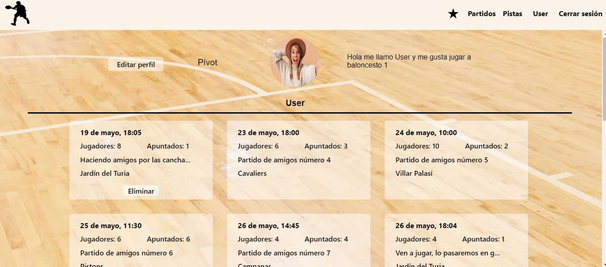
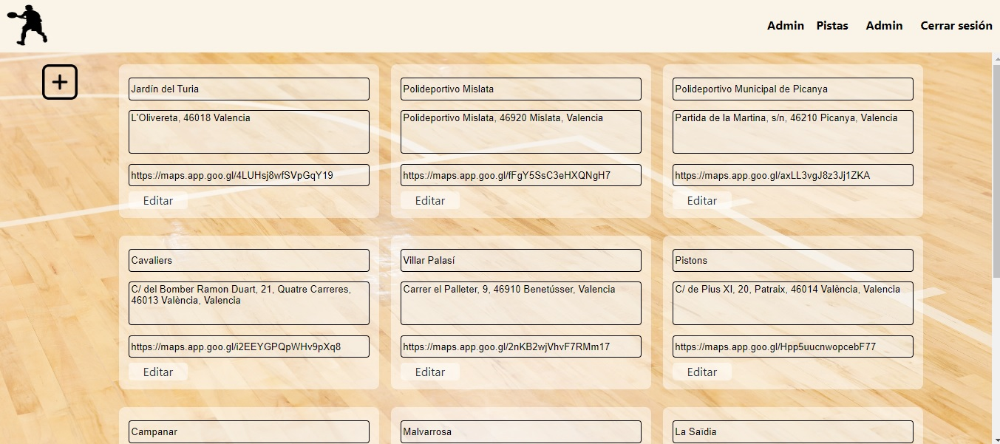

# Steal-Dunk

Bienvenido a la documentación del frontend de mi web de partidos de baloncesto. Es mi octavo y último proyecto dearrollado en GeeksHubs Academy en el cual se ponen en práctica habilidades de desarrollo frontend con React.


## Tabla de contenido :page_with_curl:

- [Tecnologías.](#tecnologías-star2)
- [Características.](#características-bookmark)
- [Instalación en local.](#instalación-en-local-gear)
- [Usuarios modelo](#usuarios-modelo-pouting_face)
- [Futuras funcionalidades.](#futuras-funcionalidadesrocket)
- [Autor.](#autor-curly_haired_man)
- [Agradecimientos.](#agradecimientos)

### Tecnologías :star2:

     


### Características :bookmark:

La página web está compuesta por **14 vistas** de las cuales 4 de ellas tan solo tiene acceso el administrador

<details>

<summary>Login</summary>


</details>


<details>

<summary>Register</summary>

- El nickname será el que posteriormente nos aparecerá en el header.


</details>


<details>

<summary>Partidos</summary>

- Encontramos todos los partidos ordenados de más cercano en fecha a más lejano. Al final tenemos sombreados los partidos que ya han pasado ordenados de forma que sale el primero el más reciente.
- Podemos apuntarnos y borrarnos de los partidos.
- Desde esta vista accedemos a crear un nuevo partido.


</details>


<details>

<summary>Nuevo partido</summary>

- Tan solo tendremos que rellenar los campos requeridos para crear un nuevo partido.
- El usuario que crea un partido se apunta en él automáticamente.


</details>


<details>

<summary>Pistas</summary>

- Todas las pistas disponibles en las que los usuarios pueden crear partidos.
- Tenemos un símbolo de una estrella en la que si los usuarios clican añadirán esa pista a sus favoritas.
- Por otro lado tenemos un símbolo de ubicación el cual al clicarlo nos abrirá la ubicación de la pista en google maps.


</details>


<details>

<summary>Pistas favoritas</summary>

- Nos muestra las pistas favoritas que tiene seleccionada el usuario.
- Si clicamos en el boton "partidos", nos llevará a todos los partidos que existen de esa pista.


</details>


<details>

<summary>Partidos por pista</summary>

- Encontramos de forma ordenada por fecha los partidos que existen para esta pista.


</details>


<details>

<summary>Perfil</summary>

- Disponemos de un botón para editar perfil el cual nos llevará a otra vista donde trataremos los datos.
- Se muestran todos los partidos a los que el usuario se ha apuntado.
- Desde aquí el usuario podrá eliminar los partidos que haya creado.



</details>


<details>

<summary>Editar perfil</summary>

- El usuario podrá modificar todos los campos excepto el email.
- En el campo de la imagen tiene que introducir una url.
- El campo de la posición tiene 3 opciones predeterminadas.
- Al clicar el botón "editar", los campos se vuelven editables, una vez los modifiquemos clicaremos en confirmar.


</details>


<details>

<summary>Partido en detalle</summary>

- Podemos acceder a ella tanto desde la vista de todos los partidos como desde los partidos a los que estamos apuntados en nuestro perfil.

- Nos muestra la información completa del partido que seleccionemos.


</details>


<details>

<summary>Admin</summary>

- Desde aquí el administrador podrá gestionar usuarios, pistas y partidos.
- Tenemos 3 tablas:
Tabla de usuarios.


Tabla de partidos.


Tabla de pistas.

- Desde esta tabla podemos eliminar las pistas y crear una nueva. 


</details>


<details>

<summary>Editar pistas</summary>

- En la esquina superior izquierda tenemos un botón con acceso a crear una nueva pista.
- Disponemos de todas las pistas las cuales podemos editar clicando en el botón "editar" y confirmando una vez finalicemos.



</details>


<details>

<summary>Nueva pista</summary>

- Rellenaremos los 3 campos solicitados para crear una nueva pista.


</details>


### Instalación en local :gear:

**1. Clonar el repositorio.**
````
$ git clone https://github.com/VictorBlasco5/Final-project-frontend.git


````
**2. Instalar las dependencias.**

````
$ npm install
````

**3. Poner en marcha el servidor.**
````
$ npm run dev
````

Necesitarás el [backend.](https://github.com/VictorBlasco5/Final-project-backend)


### Usuarios modelo :pouting_face:

#### User
````
Email: user@user.com
Contraseña: Aa12345
````

#### Admin
````
Email: admin@admin.com
Contraseña: Aa12345
````


### Futuras funcionalidades:rocket:

- Poder apuntarse a los partidos desde las diferentes vistas.
- Buscador en la vista de los partidos y en las tablas del admin.
- Mejorar la forma de introducir imágenes en el perfil.


### Autor :curly_haired_man:
- **Víctor Blasco** - Project Developer.
   - [GitHub](https://github.com/VictorBlasco5)
   - [LinkedIn](https://www.linkedin.com/in/victor-blasco-4b7588304/)

### Agradecimientos 
- Agradecimiento a GeeksHubs Academy por su implicación en mi aprendizaje.